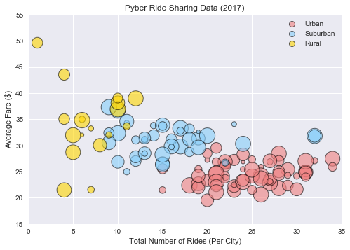
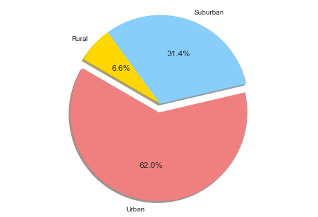
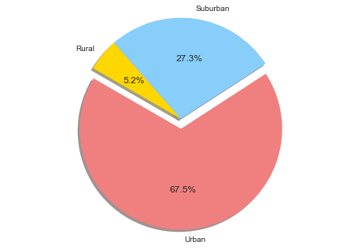
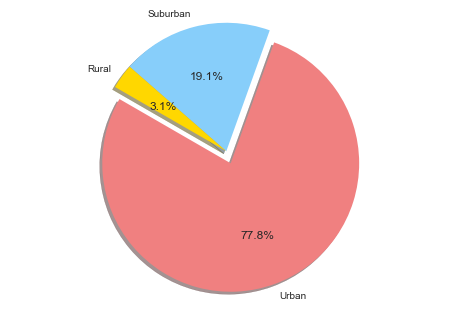

```python
# Read CSV
import pandas as pd
```


```python
# Read city data
city = pd.read_csv("raw_data/city_data.csv")
```


```python
# Read ride data
ride = pd.read_csv("raw_data/ride_data.csv")

```


```python
# Total rides per city
cityRides = ride.groupby("city")["ride_id"].count().to_frame().reset_index()
cityAvgFair = ride.groupby("city")["fare"].mean().to_frame().reset_index()
```


```python
# Create df for plotting

from functools import reduce

merge = [city, cityRides, cityAvgFair]
df = reduce(lambda left, right: pd.merge(left, right, on = "city"), merge)
df = df.rename(columns = {"ride_id": "# rides",
                        "fare": "avg fares",
                        "driver_count": "# drivers"
                         })
df.head()
```


<div>
<style>
    .dataframe thead tr:only-child th {
        text-align: right;
    }

    .dataframe thead th {
        text-align: left;
    }

    .dataframe tbody tr th {
        vertical-align: top;
    }
</style>
<table border="1" class="dataframe">
  <thead>
    <tr style="text-align: right;">
      <th></th>
      <th>city</th>
      <th># drivers</th>
      <th>type</th>
      <th># rides</th>
      <th>avg fares</th>
    </tr>
  </thead>
  <tbody>
    <tr>
      <th>0</th>
      <td>Kelseyland</td>
      <td>63</td>
      <td>Urban</td>
      <td>28</td>
      <td>21.806429</td>
    </tr>
    <tr>
      <th>1</th>
      <td>Nguyenbury</td>
      <td>8</td>
      <td>Urban</td>
      <td>26</td>
      <td>25.899615</td>
    </tr>
    <tr>
      <th>2</th>
      <td>East Douglas</td>
      <td>12</td>
      <td>Urban</td>
      <td>22</td>
      <td>26.169091</td>
    </tr>
    <tr>
      <th>3</th>
      <td>West Dawnfurt</td>
      <td>34</td>
      <td>Urban</td>
      <td>29</td>
      <td>22.330345</td>
    </tr>
    <tr>
      <th>4</th>
      <td>Rodriguezburgh</td>
      <td>52</td>
      <td>Urban</td>
      <td>23</td>
      <td>21.332609</td>
    </tr>
  </tbody>
</table>
</div>


```python
# BUBBLE PLOT

import seaborn as sns
import matplotlib.pyplot as plt

types = ["Urban", "Suburban", "Rural"]
colors = ["lightcoral", "lightskyblue", "gold"]

for i, t in enumerate(types):
    
    xi = df["# rides"][df["type"] == t]
    yi = df["avg fares"][df["type"] == t]
          
    plt.scatter(x = xi, y = yi,
           s = df["# drivers"] * 7,
           c = colors[i],
           alpha = .6, linewidth = 1, edgecolors = 'black',
           label = t)
    
plt.legend(markerscale = .5)
plt.xlim(0, 35)
plt.ylim(15, 55)
plt.title("Pyber Ride Sharing Data (2017)")
plt.xlabel("Total Number of Rides (Per City)")
plt.ylabel("Average Fare ($)")
plt.show()
```





```python
# df for pie charts
cityTotFare = ride.groupby("city")["fare"].sum().to_frame().reset_index()
cityRides = ride.groupby("city")["ride_id"].count().to_frame().reset_index()

from functools import reduce

merge = [city, cityRides, cityTotFare]
pie = reduce(lambda left, right: pd.merge(left, right, on = "city"), merge)
pie = pie.rename(columns = {"ride_id": "# rides",
                        "fare": "Total fares",
                        "driver_count": "# drivers"
                         }).drop("city",1).groupby("type").sum().reset_index()
pie.sort_index(ascending = False, inplace = True)
pie.head()
```


<div>
<style>
    .dataframe thead tr:only-child th {
        text-align: right;
    }

    .dataframe thead th {
        text-align: left;
    }

    .dataframe tbody tr th {
        vertical-align: top;
    }
</style>
<table border="1" class="dataframe">
  <thead>
    <tr style="text-align: right;">
      <th></th>
      <th>type</th>
      <th># drivers</th>
      <th># rides</th>
      <th>Total fares</th>
    </tr>
  </thead>
  <tbody>
    <tr>
      <th>2</th>
      <td>Urban</td>
      <td>2607</td>
      <td>1625</td>
      <td>40078.34</td>
    </tr>
    <tr>
      <th>1</th>
      <td>Suburban</td>
      <td>638</td>
      <td>657</td>
      <td>20335.69</td>
    </tr>
    <tr>
      <th>0</th>
      <td>Rural</td>
      <td>104</td>
      <td>125</td>
      <td>4255.09</td>
    </tr>
  </tbody>
</table>
</div>


```python
# % of Total Fares by City Type

plt.pie(pie["Total fares"], labels = types, colors = colors,
       autopct = "%1.1f%%", shadow = True, startangle = 150,
       explode = (.1,0,0))
plt.axis("equal")
plt.show()
```





```python
# % of Total Rides by City Type

plt.pie(pie["# rides"], labels = types, colors = colors,
       autopct = "%1.1f%%", shadow = True, startangle = 150,
       explode = (.1,0,0))
plt.axis("equal")
plt.show()
```





```python
# % of Total Drivers by City Type

plt.pie(pie["# drivers"], labels = types, colors = colors,
       autopct = "%1.1f%%", shadow = True, startangle = 150,
       explode = (.1,0,0))
plt.axis("equal")
plt.show()
```





```python

```
